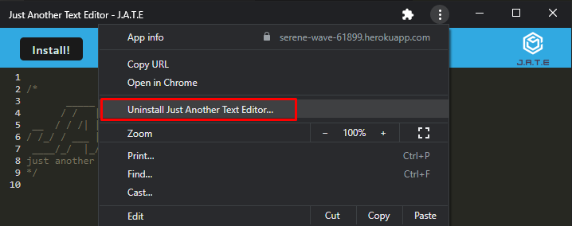

# text-editor-pwa
This is a text editor app that is a Progressive Web Application, so it can work 
offline using cached data.

That is, this app that lives in your web browser is capable of being installed
locally with nothing more than the chrome web browser installed locally.

For more information on PWAs [wikipedia has a great article](https://en.wikipedia.org/wiki/Progressive_web_application)


## Installation

If you wish to run the application locally there are two methods to install it.

You can go to the deployed website https://serene-wave-61899.herokuapp.com/ and
click the install button to make the application availible to your machine.

OR you could download the repository to host it yourself. 

Doing so will require an installation of node.js.

Clone the repository and run `npm run install` in the root directory. After the
installation process has completed run `npm run start` in order to start the app

After the setup is complete you can visit `localhost:3000` to see the contents
of the app.

You can then make an installation that no longer cares if you have the 
repository downloaded by clicking the install button in the upper left.

This application was only tested using desktop Google Chrome, so I can't speak 
to the results of trying to use another web brower for it. 

## Usage

This is a normal text editor that supports some lightweight syntax highlighting. 

It is not attempting to be a fully functional text editor to replace your 
regularly installed one such as vscode, notepad++, or even just text edit. It 
is merely a demonstration of what you can do with a PWA.

## How this works

This application is made with the help of [webpack](https://webpack.js.org/) 
which does a fantastic job of bundling everything together into some nice 
minified code to run. 

When you run `npm run start` Webpack bundles the entire application into a 
folder called `dist/` and then node starts an express server that serves the 
content to `localhost:3000`

The application itself then creates a [service worker](https://developer.chrome.com/docs/workbox/service-worker-overview/) to manage itself.

The sercice worker will check to see if it has anything stored in your web 
browser's cache, first checking session storage, then checking your l
ocalstorage. If nothing is found it will then put the default text up

```
/*
       _____  ____________
      / /   |/_  __/ ____/
 __  / / /| | / / / __/   
/ /_/ / ___ |/ / / /___   
 ____/_/  |_/_/ /_____/   
just another text editor
*/                          

```

Any time the browser loses focus the service worker will update your cache to 
hold any text in the text box, which will be availible if you refresh the page 
and even if you lose connectivity to the internet and refresh it. 

## Uninstalling

In order to completely uninstall the app after running it locally you will need 
to delete the service worker. The service worker will delete itself after 30 
days, but in case you don't wish to wait that long you can simply unregister it 
on your own by opening the developer tools. You can do this by pressing `F12` 
on your keyboard or by right clicking anywhere on the page and clicking 
`inspect element`

After you open the console, navigate to `Application` on the top, then click 
`Service Workers` on the left hand side and then click on the link to unregister
the service worker.


To uninstall the pwa, launch it, click the three dots in the upper right corner,
then click `Uninstall Just Another Text Editor`





## Technologies


## License
[](https://opensource.org/licenses/MIT)
## Credits

mit license badge: https://gist.github.com/lukas-h/2a5d00690736b4c3a7ba
technologies badges: https://github.com/Ileriayo/markdown-badges#table-of-contents

Deployed to: https://serene-wave-61899.herokuapp.com/